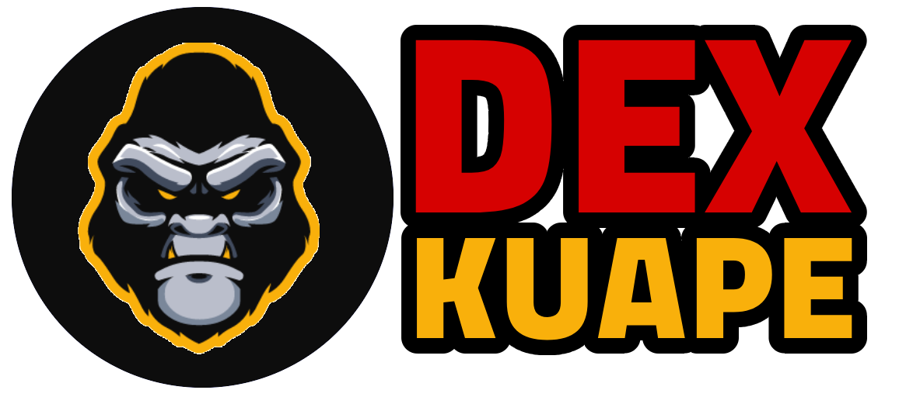

# KuApeDex

KuApeDEX is the first decentralized trading platform on the KCC network to offer the lowest platform transaction fees \(0.1 percent\), with fees refunded in $KUAPE, our native currency. This network ensures increased performance and much lower network transaction costs. KuApeDEX aspires to establish itself as the market's leading DEX platform for token swaps. Through our high-quality goods and services we are firmly devoted to delivering true value, justice, and innovation to decentralized finance. KuApeDEX is a fast and secure platform where anyone can exchange and earn tokens.

